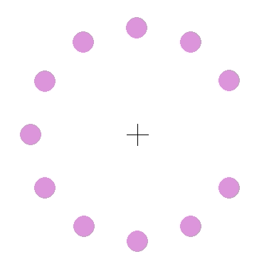

# pygame_illusion

Based on a gif that I saw online where if you stare at the middle point you start seeing artifacts of a blue circle after the purple circle dissapears.

This was a highschool project that I rewrote for fun.

Highschool code can be seen under `old` branch.
 
## Usage

Install dependencies `pip install -r requirements.txt`
Run script `python main.py`
